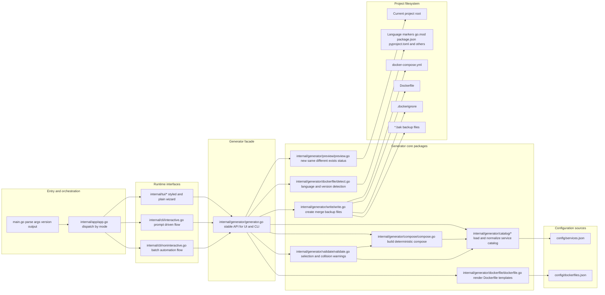

# Docker Wizard Architecture Diagram

## Module responsibilities
- `main.go`: parses CLI flags, validates option combinations, prints version, then calls app runtime.
- `internal/app/app.go`: central mode router (`styled`, `plain`, `cli`, `batch`) and runtime entrypoint.
- `internal/tui/*`: Bubble Tea state machine and views for the step-by-step wizard flow.
- `internal/tui/wizard.go`: step-specific key handlers keep transitions readable while preserving one state model.
- `internal/cli/interactive.go`: prompt-based interactive CLI path using the same generator APIs.
- `internal/cli/noninteractive.go`: batch mode orchestration for CI/script workflows (`--services`, `--language`, `--dry-run`, `--write`).
- `internal/generator/generator.go`: facade layer that exposes generator operations to UI/CLI callers.
- `internal/generator/catalog/*`: reads and validates service definitions from `config/services.json`.
- `internal/generator/dockerfile/*`: detects language/version from project files and renders templates from `config/dockerfiles.json`.
- `internal/generator/compose/compose.go`: builds deterministic compose output and expands required service dependencies.
- `internal/generator/validate/validate.go`: computes warning messages (dependency issues and host port collisions).
- `internal/generator/preview/preview.go`: computes pre-write file status (`new`, `same`, `different`, `exists`) using the same merge functions used by write.
- `internal/generator/write/write.go`: writes managed files, performs user-priority merge (existing values win), and creates `.bak` backups.
